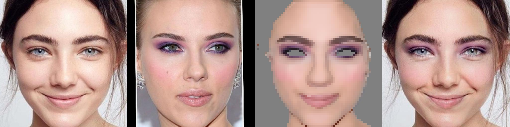
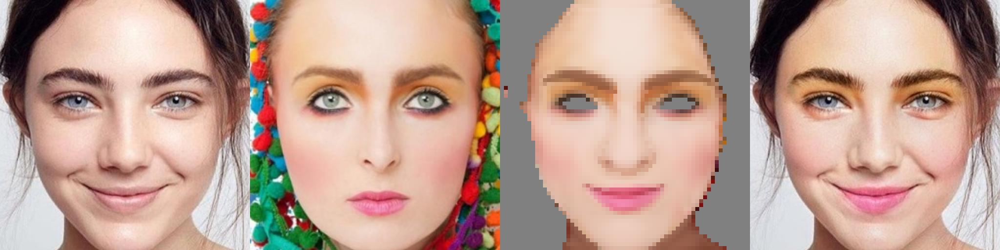
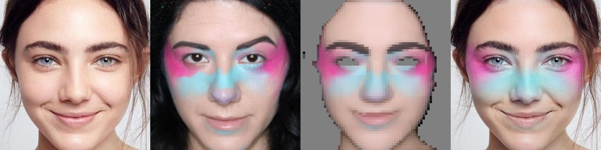
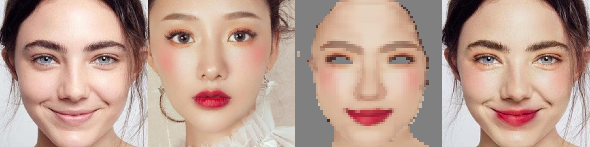
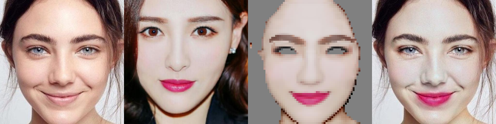

## FPMT: Fast and Precise High-Resolution Makeup Transfer via Frequency Decomposition








### Requirements

A suitable [conda](https://conda.io/) environment named `FPMT` can be created
and activated with:

```
conda env create -f environment.yaml
conda activate FPMT
```

### Pretrained Models

The pre trained FPMT with L=3 model has been provided in folder `weights`. Due to the parameter of FPMT being only 0.95M, its `pth` file size is approximately 3.6M.

### Run the examples

In the current directory, run the following command

```
python eval.py
```

The corresponding generated results have been placed in folder `examples_results\test_pair`

### How to run your own data

1. Face alignment. Please refer to the [BeautyGAN](https://github.com/wtjiang98/BeautyGAN_pytorch) or [PSGAN](https://github.com/wtjiang98/PSGAN) code to crop the image according to the face landmarks.

2. Prepare face parsing.  In our experiment, face parsing is generated by https://github.com/zllrunning/face-parsing.PyTorch.

3. Put face images in the `./examples/images/makeup` and `./examples/images/non-makeup`. Put the results of face parsing in the `./examples/seg1/makeup` and `/examples/seg1/non-makeup`.

4. Run `python eval.py`.
